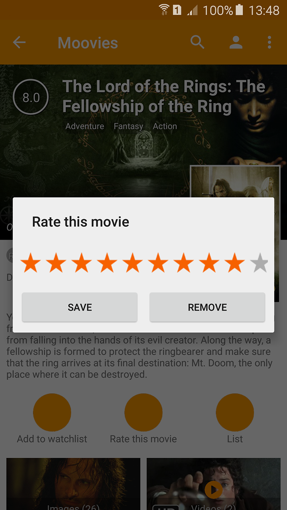
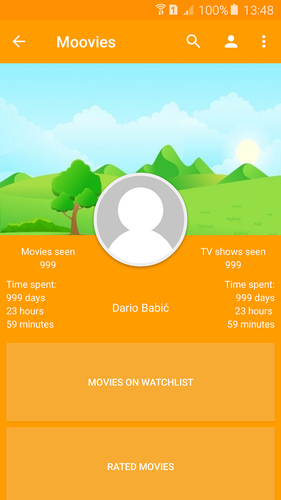

# Moovies

This application allows user to browse movies and tv shows, it displays most recent, upcoming, most popular and top rated movies
and tv shows. User can check movie and tv show details, rate them and add custom lists or watchlist. There is also a search functionality 
that currently only works for movies. 

## Under construction

This application is still under construction, and there is a lot more features to come.

## Features

* Browse most recent, upcoming, most popular and top rated movies and tv shows
* Get movie or tv show detail
* Get details about specific celebritie
* Search movies
* Watch trailers

## Screenshots

* Check most recent, upcoming, most popular and top rated movies and tv shows

         

* Check movie details, check if it belongs to collection, add it to watchlist or rate it

            
         

* Check trailers

   

* Check tv show details

         

* Check celebritie profile
   
   

* Search for specific movie

   

* Check your profile with informations about movies and tv shows you have seen

   

## Libraries

[Retrofit](https://square.github.io/retrofit)

[RxJava](https://github.com/ReactiveX/RxJava)

[Dagger](https://google.github.io/dagger/)

[Picasso](http://square.github.io/picasso/)

[Butter Knife](http://jakewharton.github.io/butterknife/)

[Expandable Text](https://github.com/Manabu-GT/ExpandableTextView)

[Hedge hog rating bar](https://github.com/hedge-hog/RatingBar)

[Chips Layout Manager](https://github.com/BelooS/ChipsLayoutManager)

## References

[TMDb](https://www.themoviedb.org)

[Android Clean Architecture](https://github.com/android10/Android-CleanArchitecture)

[Twisted Equations playlist on Youtube about Dagger 2](https://www.youtube.com/watch?v=Qwk7ESmaCq0&list=PLuR1PJnGR-Ih-HXnGSpnqjdhdvqcwhfFU&index=1)

## Credits

This product uses the TMDb API but is not endorsed or certified by TMDb.
